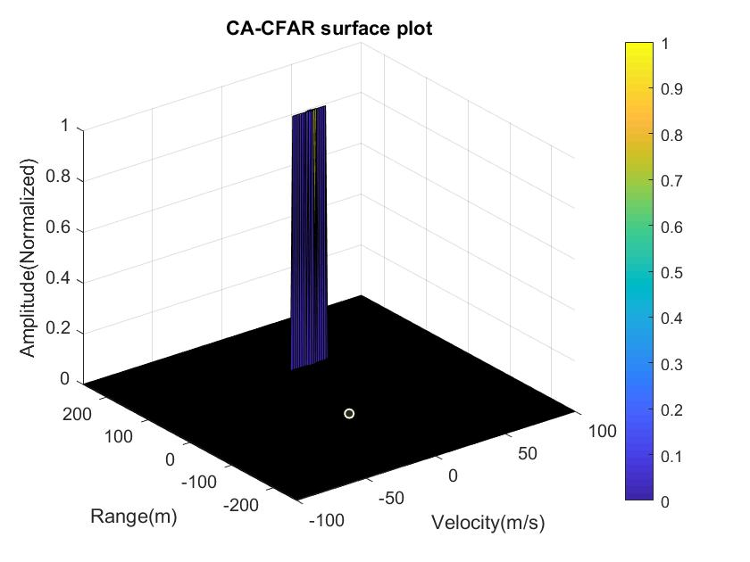

# Radar Target Generation and Detection

# Implementation Steps for the 2D CA-CFAR process

## False Alarm Rate

To avoid false detection due to constant threshold value to remove clutter we implement dynamic thresholding. Dynamic thresholding involves varying the threshold level to reduce the false alarm rate.

## Constant False Alarm Rate (CFAR)
 Constant false alarm rate (CFAR) is a dynamic thresholding scheme, which varies the detection threshold as a function of the sensed environment. In this technique, the noise at every or group of range/doppler bins is monitored and the signal is compared to the local noise level. This comparison is used to create a threshold which holds the false alarm rate constant.

 The CFAR technique estimates the level of interference in radar range and doppler cells "Training Cells" on either or both the side of the "Cell Under Test". The estimate is then used to decide if the target is in the Cell Under Test (CUT). This process loops across all the range cells and decides  the presence of target based on the noise estimate. The basis of the process is that when noise is present, the cells around the cell of interest will contain a good estimate of the noise, i.e. it assumes that the noise or interference is spatially or temporarily homogeneous.

*CACFAR (source:http://www.radartutorial.eu/)*

Cell Averaging Constant False Rate Alarm  (CA-CFAR) is the most commonly used CFAR detection technique.

 ## 2D CFAR steps

*2D CA CFAR (source:electronicproducts.com)*

2D CA CFAR technique has been implemented as shown in the lecture videos. Following steps were implemented-

1. Determine the number of training cells for each dimension Tr and Td. Similarly, pick the number for guard cells Gr and Gd.

2. Slide the cell under test (CUT) across the complete cell matrix.

3. For every iteration sum the signal level within all the training cells. To sum convert the value from logarithmic to linear using dbpow2 function.

4. Average the summed values for all of the training cells used. After averaging convert it back to logarithmic using pow2db.

5. Further add the offset to it to determine the threshold.

6. Next, compare the signal under CUT against this threshold.

7. If the CUT level > threshold assign it a value of 1, else equate it to 0.

8. To keep the map size same as it was before CFAR, equate all the non-thresholded cell to 0.

